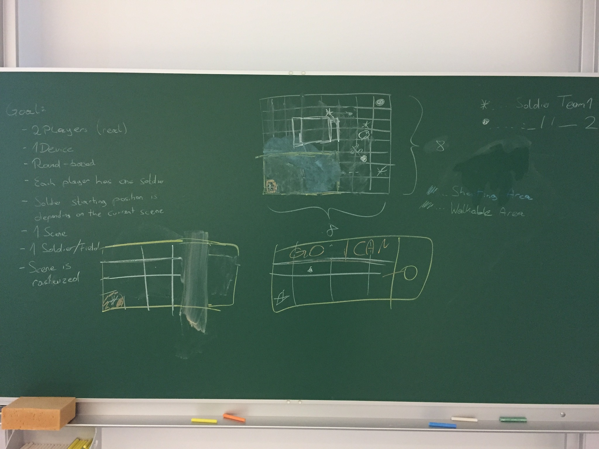

# Round-Based 2D Shooting Game

The goal of this project is to develop a round based 2D multiplayer network shooting game.

## Gameplay

At the beginning of the game a player is selected as the starting player.
Each player controls a team consisting of multiple soldiers.

Each round is only playable by one player.
The other player has to wait till the first player has finished his round.

Before a new round is started, the round of the opponent is replayed, so that the player knows what moves were made.
During a player's round he can either move a soldier or shoot from him.

A soldier has healthpoints (starting at 100) and a certain weapon assigned.
Weapons destinguish themselves in terms of bullets, specs and design, although we will only implement one weapon class at first.
A bullet has a maximum distance that it can travel and has a certain unaccuracy.
When a bullet hits a soldier a magic formula will calculate how much damage the bullet made to the gameobject.

As mentioned above, a player can move his soldiers during his round.
Each soldier has a max. distance that he can travel per round. 
Although it is possible to first move the soldier and then shoot in the same round, doing so will decrease the accuracy of the weapon.

When a player does not want or cannot make any new moves, the round will be finished.

The goal of the game is to kill all enemy soldiers.

## Battlefield Design

Besides only spawning soldiers on the battlefield, obstacles will be introduced that absorb bullets. 
Some obstacles can also have healthpoints and they are considered destroyed once they reach 0 or below.

## Graphics

As mentioned in the introduction, this game will be in 2D and we'll mostly use publicly availble bit assets.

## Scope

For v1.0 we want to concentrate on the most important things. 
The following image illustrates our goals.

